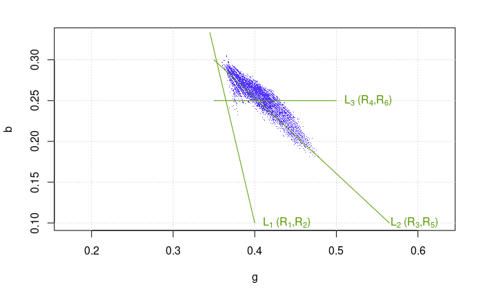

```{r, include = FALSE}
knitr::opts_chunk$set(
  collapse = TRUE,
  comment = "#>",
  fig.path = "man/figures/README-",
  out.width = "100%"
)
```

# pixelclasser

<!-- badges: start -->
[](https://www.repostatus.org/#active)
[](https://codecov.io/gh/ropensci/pixelclasser?branch=master)
<!-- badges: end -->

This package contains a set of tools to classify the pixels of digital images into colour categories arbitrarily defined by the user. It is a simple version of the multivariate technique known as Support Vector Machine, adapted to this particular use.

The procedure is simple. A digital image in JPEG or TIFF format is imported into R. The original image contains three colour variables (or bands): $R$, $G$, and $B$. The first step is to transform them into proportions ($r$, $g$ and $b$), which simplifies the problem into a bivariate one. The pixels of the test images can then be represented in the plane defined by two of the variables (the user judges which two are more convenient by trial and error) and, hopefully, they would form separate clusters (pixel categories). The user then traces straight lines (classification rules) that enclose the pixel clusters. Using the mathematical expression for these rules and the values of the transformed variables, each pixel can be classified in one category.  This produces a set of logical matrices (incidence matrices) indicating which pixels belong to each category, stored in appropriate R objects. These can be submitted to posterior analysis or used to create a new version of the original image showing the category of each pixel.

`pixelclasser` contains functions to visualize the pixels of the images and the rules created by the user, to create the rules and to store them in objects that can be passed to function `classify_pixels()` for the analysis of the image, and functions to import and export the original and the classified images. 

## Installation

You can install the development version from GitHub using `remotes` or `devtools`

```{r eval=FALSE}
remotes::install_github("ropensci/pixelclasser", build_vignettes = TRUE)
devtools::install_github("ropensci/pixelclasser", build_vignettes = TRUE)
```

## Using pixelclasser

The manual with the description of each function and use examples can is the
file `/doc/pixelclasser_0.8.0.pdf`.

An example session is described in the vignette included in the package:

```{r eval=FALSE}
vignette("pixelclasser")
```

The vignette explains how to use the code and illustrates the procedure outlined above using a set of images included as package data. This is a summary of the vignette contents. The following image is the example used in the vignette: dead, ivy and oak leaves on the soil in the campus gardens. The small images are representative of each category.

```{r echo=FALSE, fig.align='center', out.width = "50%"}
knitr::include_graphics('./inst/extdata/ExampleImages.png')
```

This image shows the pixels of the original image (black) and, overlaid, those of the small images: dead (brown), ivy (blue) and oak leaves (green). They were plotted using the values of the $g$ and $r$ colour variables (the example was an RGB digital image).    

```{r echo=FALSE, fig.align='center', out.width = "50%"}
knitr::include_graphics('./inst/extdata/ReadMeFig01.png')
```

The user defines straight lines that serve as borders of the area occupied by each pixel category. The figure shows line $L_{1}$ which separate the dead leaf pixels from the others, and lines $L_{2}$ and $L_{3}$ which separate the ivy from the oak pixels. Each line defines two rules (pixels above or underneath the line). They were defined using the oak pixels but note that ivy pixels trespass into the oak area, so they were not totally separable.

```{r echo=FALSE, fig.align='center', out.width = "50%"}

```

Using the mathematical expressions of the rules, the pixels were classified as belonging or not to each category and classified images produced. Below are the original image, the image classified using $L_{1} alone (dead/fresh leaves) and the full classified image.

```{r echo=FALSE, fig.align='center'}
knitr::include_graphics('./inst/extdata/ClassifResults.png')
```
