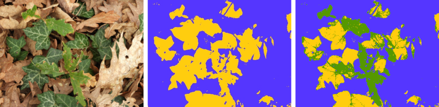

```{r, include = FALSE}
knitr::opts_chunk$set(
  collapse = TRUE,
  comment = "#>"
)
```

# Introduction #

This package contains a set of tools to classify the pixels of digital images into colour categories arbitrarily defined by the user. It contains functions to

* visualize the distribution of the pixel colours in the images,
* define classification rules
* classify the pixels and to store this information in R objects,
* save these as image files.

It is a simple version of the multivariate technique known as Support Vector Machine (Cortes and Vapnik, 1995; Bennet and Campbell, 2000), adapted to this particular use. A manuscript describing the package `pixelclasser` and its use in real research has been submitted to Methods in Ecology and Evolution (Real et al., 2021). It also describes the procedure in more detail than the next paragraphs. 

### The procedure ###

The basic steps of the procedure are the following:

* One or more digital images in JPEG or TIFF format is imported into R. The categories to identify are represented in this set (the test set).
* The values of the three three colour variables (or bands) that compose each image (*R*, *G*, and *B*) are transformed into proportions (*r*, *g* and *b*).
* The pixels of the image are plotted in the plane defined by two of the transformed variables (the user can select them arbitrarily) and, hopefully, they would form separate clusters (pixel categories).
* The user then traces straight lines that separate the pixel clusters. Using the mathematical expression for these rules and the *rgb* values, each pixel can be tested for membership in each category (see below).
* Recording the results of the tests as 1 or 0 (pass/fail), an incidence matrix is build for that rule. This is the result of the procedure, which can be submitted to posterior analysis or used to create a new version of the original image showing the category of each pixel.

The second step simplifies the problem because it makes one of the variables dependent on the other two (as *r + g + b* = 1). Moreover, the transformation eliminates colour variations due to differences in illumination.

The expressions for classification rules are the same as the expression for a straight line but using one of the comparison operators $<$, $\leq$, $>$ or $\geq$. For example: $r \geq a g +c$, being $a$ and $c$ the slope and intercept of the line, and $r$ and $g$ the colour variables selected for the classification. A single line can produce two classification rules.

### Using several rules per category ###

When there are more than two categories, or when the cluster of points has a complex shape, a single rule is not enough. In these cases the procedure has additional steps:

* several rules are defined for each category,
* incidence matrices are created for each rule,
* the incidence matrices are combined with the `&` operator to obtain the category incidence matrix.

The last step is equivalent to estimate the union of the incidence matrices, i e $\mathbf{M} = \mathbf{M}_{1} \cap \mathbf{M}_{2} \cap \ldots \cap \mathbf{M}_{p}$, being *p* the number of rules.

### Concave category shapes ###

A caveat of the method is that the rules must delimit a convex polygon to combine the individual rule results successfully (in a convex polygon, a line joining any two internal points is contained in the polygon). Not all clusters have convex shape. In these cases, the cluster must be divided in convex sub-polygons (subcategories) for which rules are defined as before. The incidence matrices of the subcategories are combined using the `|` operator, i.e. $\mathbf{M} = \mathbf{M}_{1} \cup \mathbf{M}_{2} \cup \ldots \cup \mathbf{M}_{s}$, being *s* the number of subcategories. Note that any polygon, convex or not, can be subdivided in triangles and, as triangles are convex polygons, it is always possible to solve this problem. Note that the goal is to obtain a minimal set of convex polygons, not a complete triangulation. The example presented below is one of such cases.

# The session #

What follows is a sample session illustrating both the method and the use of the package functions. It uses an example image and a test set created by cutting small areas out of the example image. It is not a good test set, see below, but it is enough to show how the method works, and its problems.

### Loading the functions ###

The package is loaded in the usual way:

```{r}
library(pixelclasser)
```
  
### Image loading and transforming ###

These are the images included in the package as examples. The goal is to identify the pixels corresponding to dead, oak and ivy leaves that compose the image. The small images are fragments of the main image and are the test set. In an actual case, more than one image per category should be used to represent the whole variation of the category:

```{r echo=FALSE, fig.align='center', out.width = "50%"}
knitr::include_graphics('../inst/extdata/ExampleImages.png')
```

As the images are included in the package as external (non R) data, they are loaded with the following code:

```{r}
ivy_oak_rgb <- read_image(system.file("extdata", "IvyOak400x300.JPG", package = "pixelclasser"))
test_ivy_rgb <- read_image(system.file("extdata", "TestIvy.JPG", package = "pixelclasser"))
test_oak_rgb <- read_image(system.file("extdata", "TestOak.JPG", package = "pixelclasser"))
test_dead_rgb <- read_image(system.file("extdata", "TestDeadLeaves.JPG", package = "pixelclasser"))
```

The function `read_image()`  performs the first step of the procedure. It stores the image as an array of *rgb* values, which are the proportion of each colour variable (i.e. *R /(R+G+B)*, and so on). This uses functions from packages `jpeg` or `tiff`, and uses the extension in the file name to identify which one to use.

### Pixel distributions in *rgb* space ###

Before plotting pixels and lines, it is convenient to define a set of colours to use throughout the session:
  
```{r}
transparent_black <- "#00000008"
brown <- "#c86432ff"
yellow <- "#ffcd0eff"
blue <- "#5536ffff"
green <- "#559800ff"
```

The next step is to visualize the distribution of the pixels in *rgb* space, but only two variables are needed. Any pair of variables would do, but a particular combination might produce a better display of the clusters. It is a matter of try the three possible combinations to select the most convenient.

Plotting the pixels is a two-step procedure: a void plot is drawn first and then the pixels are added to the plot (the use of a transparent black colour, `#00000008`, creates a "density plot" effect):
  
```{r, out.width = "50%", fig.align="center", out.width = "50%"}
plot_rgb_plane("r", "b", main = "Image: ivy and oak")
plot_pixels(ivy_oak_rgb, "r", "b", col = transparent_black)
```

The coloured lines are an aid to interpret the graph: no pixels could be found outside the blue lines, and the red lines converging in the barycentre of the triangle *(r, g, b)* = (1/3, 1/3, 1/3), define the areas where a colour is dominant. Note that graphical parameters (`main` in this example) can be passed to the function to change the final appearance of the graph. All the auxiliary lines can be deleted, as in the following example, which uses different colour variables to create the graph.

```{r, fig.align="center", out.width = "50%"}
plot_rgb_plane("r", "g", plot_limits = F, plot_guides = F, plot_grid = F)
plot_pixels(ivy_oak_rgb, "r", "g", col = transparent_black)
```

There are two clear pixel clusters and a small, but noticeable, quantity of pixels in between. Also visible are linear patterns that are artefacts created because the *RGB* data are discrete variables (eight bit in the most common cases). These are more appreciable in the following graphs, which are restricted to the area occupied by the pixels. In the following examples *g* and *b* will be used as variables *x* and *y* for plotting and pixel classification. 

### Adding the pixels of the test images ###

The following code plots the pixels of the example image on the *gb* plane and then adds the pixels of the test images, using arbitrary colours. Here, the graphic parameters `xlim` and `ylim` were used to limit the extent of the plot to the area occupied by the pixels:
  
```{r, fig.align="center", out.width = "50%"}
plot_rgb_plane("g", "b", xlim = c(0.2, 0.6), ylim = c(0.1, 0.33))
plot_pixels(ivy_oak_rgb, "g", "b", col = transparent_black)
plot_pixels(test_oak_rgb, "g", "b", col = green)
plot_pixels(test_ivy_rgb, "g", "b", col = blue)
plot_pixels(test_dead_rgb, "g", "b", col = brown)
```

The plot shows that the clusters of pixels in the `ivy_oak_rgb` image correspond to dead leaves (on the left), and oak and ivy (on the right).

The small areas taken as test images were not representative of the whole pixel set in the image, as they do not cover the same area as the black pixels. This is not a surprise given that a single sample was collected for each type of pixel.

Warning: plotting several million points in an R graph is an slow process. Be patient or use images as small as possible. Using a nice smartphone with a petapixel camera sensor to capture images is good for artistic purposes, but not always for efficient scientific work.

### Defining the rules ###

Defining the rules that classify the pixels is a matter of tracing straight lines to separate the clusters. In this example, a single line more or less equidistant to both clusters should suffice to separate them. The intermediate points will be arbitrarily ascribed to one category.

The rules are defined by setting the name of the rule, the colour variables to use, the coordinates of two points in the plane and a comparison operator. The exact placement of the line is an arbitrary decision, as the method does not include any mechanism to place it automatically.

There are two methods to create the rule. The first uses the function `create_rule()`, which receives a list with the coordinates of two points defining a line in the selected subspace. In the following example, the points with coordinates (*g*, *b*) = (0.345, 1/3), and *(g,b)* = (0.40, 0.10) defined the position of the first line, and were selected by trial and error. The adequate operator must be included in the rule definition:
  
```{r}
rule_01 <- define_rule("rule_01", "g", "b", list(c(0.345, 1/3), c(0.40, 0.10)), "<")
rule_02 <- define_rule("rule_02", "g", "b", list(c(0.345, 1/3), c(0.40, 0.10)), ">=")
```

Both rules are described by the same line but use different comparison operator. `rule_01` includes the pixels at the left (under) of the line and `rule_02` those at the right (over) and on the line, i.e. the dead leaves and the fresh leaves, respectively. Each line can generate two rules, but beware: if `>` and `<` define the rules, then the points on the line will not belong to any category, and if `>=` and `<=` are used, the points on the line will belong to the two categories simultaneously. The function that classifies the pixels can identify the second type of error, but if there are legitimate unclassified points, the first type can pass unnoticed.

The second method uses `place_rule()`, which is a wrapper for `graphics:locator()` that allows the user to select the two points by clicking in the rgb plot with the mouse:

```
rp01 <- place_rule("g", "b")
rp02 <- place_rule("g", "b", "v")
rule_07 <- define_rule("rule_07", "g", "b", rp02, ">=")
```
The function returns an object of class `rule_points` that can then be passed to `define_rule()` in the parameter `rule_points`. The second example produces a vertical line ("h" for horizontal lines), which would be difficult to produce by hand. To make the code self-contained, `create_rule()` is used in this vignette, but using `place_rule()` is the easiest way to define the rules. It is even easier to place the call to `place_rule()` in the call to `create_rule()` to avoid creating the intermediate `rule_points` object:

```
rule_07 <- define_rule("rule_07", "g", "b", place_rule("g", "b"), "<")
```

Note that both `define_rule()` and the `rule_points` object must use the same colour variables as axis. `define_rule()` throws an error if this condition does not hold.

The rule objects store the values passed as parameters, the parameters of the equation of the line (*a* and *c*), and a textual representation of the equation which will be evaluated by the classification function. To check the correctness of the rules, the line can be added to the plot:
  
```{r, fig.align="center", out.width = "50%"}
plot_rgb_plane("g", "b", xlim = c(0.2, 0.6), ylim = c(0.1, 0.33))
plot_pixels(ivy_oak_rgb, "g", "b", col = transparent_black)
plot_pixels(test_oak_rgb, "g", "b", col = green)
plot_pixels(test_ivy_rgb, "g", "b", col = blue)
plot_pixels(test_dead_rgb, "g", "b", col = brown)
plot_rule(rule_01, lty = 2, col = brown)
```

In order to classify the fresh leaves into ivy and oak categories, more rules are needed. The pixels of the oak test image were plotted and used to define additional rules:

```{r}
rule_03 <- define_rule("rule_03","g", "b", list(c(0.35, 0.30), c(0.565, 0.10)), "<")
rule_04 <- define_rule("rule_04","g", "b", list(c(0.35, 0.25), c(0.5, 0.25)), "<")
```

Here is the plot of the pixels and the rules. Line type and colour were set using the graphical parameters `lty` and `col` (see `graphics::par)`) `...` argument of `plot_rule()`:

```{r, fig.align="center", out.width = "50%"}
plot_rgb_plane("g", "b", xlim = c(0.2, 0.6), ylim = c(0.1, 0.33), plot_limits = F, plot_guides = F)
plot_pixels(test_oak_rgb, "g", "b", col = green)
plot_rule(rule_01, lty = 2, col = green)
plot_rule(rule_03, lty = 2, col = green)
plot_rule(rule_04, lty = 2, col = green)
```

The ivy pixels are now plotted to check whether the rules can identify them. Labels to identify the lines and their associated rules were added to the plot, using the parameter `shift` to place them conveniently:
  
```{r, fig.align="center", out.width = "50%"}
plot_rgb_plane("g", "b", xlim = c(0.2,0.6), ylim=c(0.1,0.33), plot_limits = F, plot_guides = F)
plot_pixels(test_ivy_rgb, "g", "b", col = blue)

plot_rule(rule_02, lty = 1, col = green)
label_rule(rule_02, label = expression('L'[1]*' (R'[1]*',R'[2]*')'), shift = c(0.035, -0.004), col = green)

plot_rule(rule_03, lty = 1, col = green)
label_rule(rule_03, label = expression('L'[2]*' (R'[3]*',R'[5]*')'), shift = c(0.20, -0.15), col = green)

plot_rule(rule_04, lty = 1, col = green)
label_rule(rule_04, label = expression('L'[3]*' (R'[4]*',R'[6]*')'), shift = c(0.19, 0.0), col = green)
```

The graph shows two problems: a) part of the ivy pixels are inside the area delimited by the oak rules, i.e. both categories overlap. As a consequence, some ivy pixels will be miss-classified. b) The shape of the ivy cluster is not convex.

To solve the second problem, two subcategories must be defined as explained before. The first is delimited by *L~1~* and *L~3~*, and the second by *L~2~* and *L~3~*. To do this, two new rules are needed:
  
```{r}
rule_05 <- define_rule("rule_05", "g", "b", list(c(0.35, 0.30), c(0.565, 0.16)), ">=")
rule_06 <- define_rule("rule_06", "g", "b", list(c(0.35, 0.25), c(0.5, 0.25)), ">=")
```

There is an intentional error in the coordinates of the second point of `rule_05`, which are not the same as in `rule_03`. It is left here to show later how the internal checks of the classification function allow to detect it.

Note that because no points can be found outside the blue triangle, its borders are implicit rules that close the polygons defined by the explicit rules, but that do not need to be created.

### Creating the classifier objects ###

After the rules have been defined, they must be included in classifier objects which will be used later by `classify_pixels()`. This function receives a list of objects of class `pixel_cat`, each containing the information needed to identify the pixels belonging to a particular category. These objects contain a list of objects `pixel_subcat`, each containing a list of objects of class `pixel_rule`. This is a nested structure which always has three levels (rule, subcategory, and category) even when no subcategories would be needed for the classification. In these simple cases, a subcategory object containing the rules is internally added to the category object. This consistency in the structure of the objects simplifies the code of `classify_pixels()`.

Creating the classifiers is simple once the rules have been defined. The following code defines a class classifier that can identify the dead leaves:
  
```{r}
cat_dead_leaves <- define_cat("dead_leaves", blue, rule_01)
```

`define_cat()` needs a label for the category, a colour to identify the pixels if an image file is generated, and a list of rules that define the category. Here, the list contains a single rule. This is a simple case where no subcategories are needed and a list of rules suffice to classify the pixels. See below for a more complex case. The corresponding classifier for the living leaves is:

```{r}
cat_living_leaves <- define_cat("living_leaves", yellow, rule_02)
```

In these examples `define_cat()` detects that the the list contains only rules, not subcategories, and wraps them into an object of type `pixel_subcat`.

A classifier object for oak pixels needs three rules:

```{r}
cat_oak_leaves <- define_cat("oak_leaves", green, rule_02, rule_03, rule_04)
```

Finally, the classifier for ivy pixels is the most complex, as it is composed of two subcategory objects that must be defined explicitly and then included in the class classifier:

```{r}
subcat_ivy01 <- define_subcat("ivy01", rule_02, rule_06)
subcat_ivy02 <- define_subcat("ivy02", rule_04, rule_05)

cat_ivy_leaves <- define_cat("ivy_leaves", yellow, subcat_ivy01, subcat_ivy02)
```

Note that rules and subcategories cannot be mixed in the list, so sometimes a subcategory object containing a single rule should be created by the user before creating the category object. `define_cat()` checks for the type of the objects in the list and complains if they are not adequate.

### Classifying the pixels ###

Function `classify_pixels()` uses a list of categories to classify the pixels. As a preliminary example, the example image will be classified in dead and living leaves. The parameters are the object to classify and the list of category objects:
  
```{r}
dead_live_classified <- classify_pixels(ivy_oak_rgb, cat_dead_leaves, cat_living_leaves)
```

Note that a category named `unclassified` is automatically added to the classes defined by the user. With the rule set used in this example, the `unclassified` class must contain zero pixels. The function outputs counts of pixels in each classes, which are useful to verify the consistency of the rules. The function also detects duplicate pixels, i e those counted in more than one class (the sum of the pixels in each class is larger than the total number of pixels). If the consistency of the rules has been verified, these messages can be suppressed by `verbose = FALSE` in the function call.

The result can be saved as a JPEG (or TIFF) file:

```{r, eval=FALSE}
save_classif_image(dead_live_classified, "DeadLiveClassified.JPG", quality = 1)
```

The type of the file is automatically selected from the file name (only `JPEG` or `TIFF` files allowed). Note the use of the `quality` parameter, which is passed to the underlying function, to set the quality of the JPEG file produced to its maximum value.

The final classification includes the three categories:

```{r}
ivy_oak_classified <- classify_pixels(ivy_oak_rgb, cat_dead_leaves, cat_ivy_leaves, cat_oak_leaves)
```

The function informs that several points were left unclassified. This is the consequence of the error in the definition of `rule_05` noted above. If the error is corrected, and the image classified again:

```{r}
rule_05 <- define_rule("rule_05", "g", "b", list(c(0.35, 0.30), c(0.565, 0.10)), ">=")
subcat_ivy02 <- define_subcat("ivy02", rule_04, rule_05)
cat_ivy_leaves <- define_cat("ivy_leaves", yellow, subcat_ivy01, subcat_ivy02)
ivy_oak_classified <- classify_pixels(ivy_oak_rgb, cat_dead_leaves, cat_ivy_leaves, cat_oak_leaves)
```

the result is correct and it can be saved, as a `TIFF` file in this case:

```{r, eval = FALSE}
save_classif_image(ivy_oak_classified, "IvyOakClassified.TIFF")
```

The following figure shows the original image and the results of the two classifications.

```{r echo=FALSE, fig.align='center'}

```

Dead and fresh leaves were correctly differentiated in the first classification. The second classification was accurate for dead and oak pixels but, as expected, part of the ivy pixels were miss-classified as oak pixels because of the overlap between these two categories.

# References #

Bennet, K. P. and C. Campbell (2000). Support vector machines: hype or Halleluiah. SIGKDD Explorations 2, 1–11.

Cortes, C. and V. Vapnik (1995). Support-vector networks. Machine Learning 20, 273–297.

Real, C., Cruz de Carvalho, R., García-Seoane, R., Branquinho, C. and Varela, Z. (2021). A simplified support vector machine method for image classification. Submitted to Methods in Ecology and Evolution.